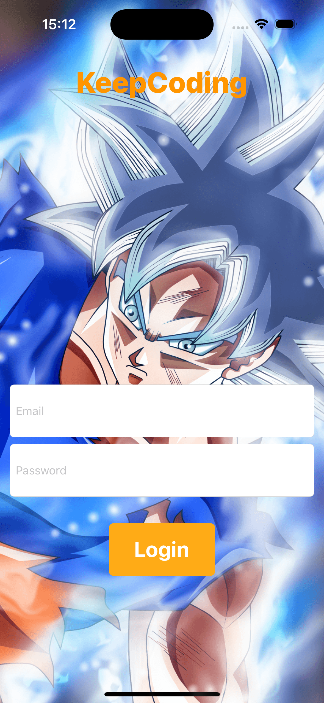
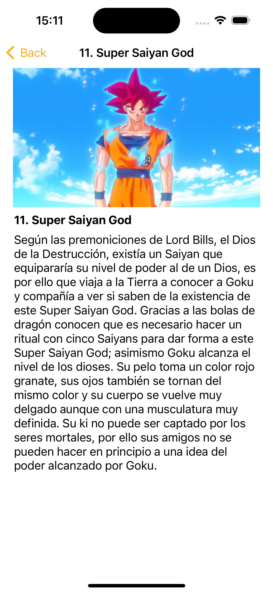
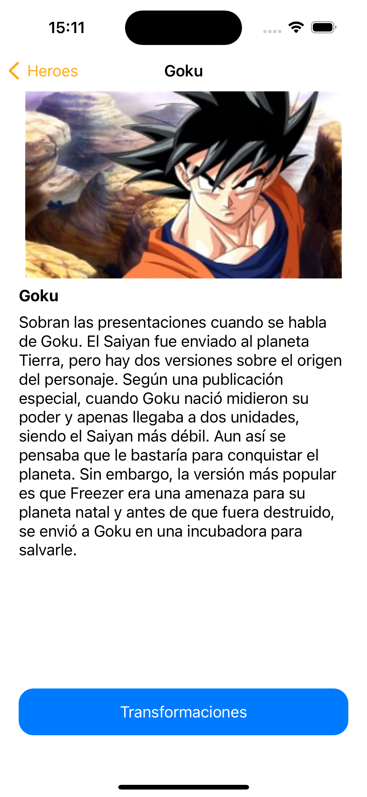
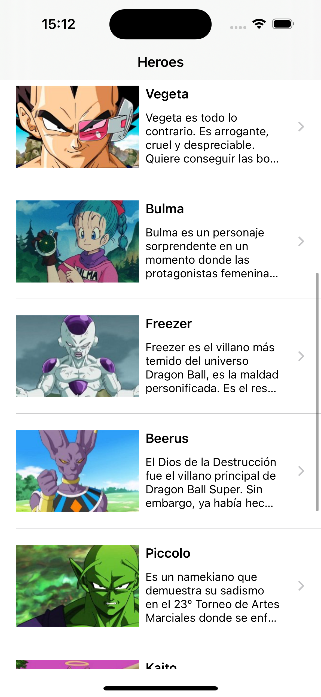
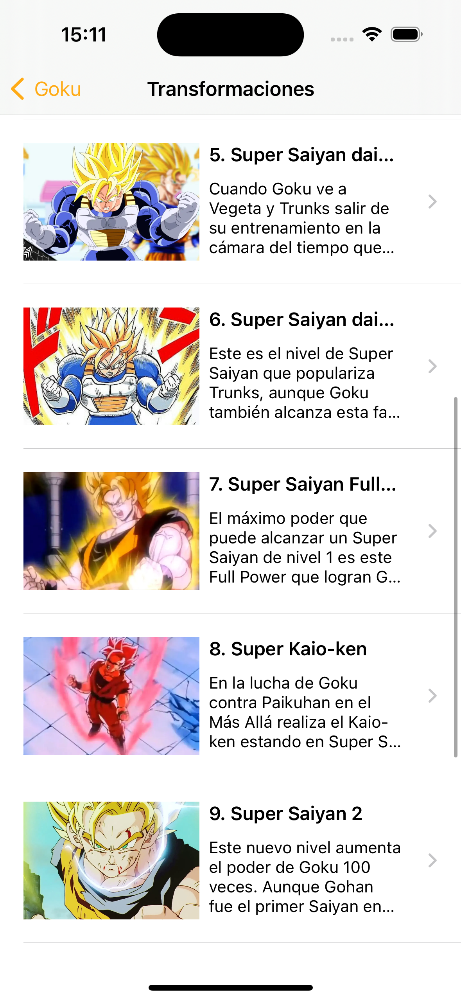

# KP-DBHeroes

KP-DBHeroes es una aplicación móvil que muestra información sobre héroes y sus transformaciones del universo Dragon Ball. Permite a los usuarios explorar una lista de héroes, ver detalles sobre cada héroe y sus transformaciones, así como marcar sus héroes favoritos.
LA API es privada de KEEPCODING

## Características

- Lista de héroes: Explora una lista de héroes del universo Dragon Ball.
- Detalles del héroe: Ver detalles sobre cada héroe, incluyendo su nombre, descripción y foto.
- Transformaciones: Explora las transformaciones de cada héroe.
- Favoritos: Marca tus héroes favoritos para acceder rápidamente a ellos.

## Capturas de pantalla

## Tecnologías utilizadas

- Swift: Lenguaje de programación utilizado para desarrollar la aplicación.
- UIKit: Marco de interfaz de usuario utilizado para construir la interfaz de usuario de la aplicación.
- XCTest: Marco de pruebas utilizado para realizar pruebas unitarias en la aplicación.

## Requisitos de instalación

- Xcode 12.0 o superior.
- iOS 14.0 o superior.

## Instalación

1. Clona este repositorio en tu máquina local.
2. Abre el archivo `KP-DBHeroes.xcodeproj` en Xcode.
3. Selecciona el simulador de iOS de tu elección.
4. Haz clic en el botón de "Build and Run" en Xcode.

## Contribución

Las contribuciones son bienvenidas. Si encuentras un error o tienes una idea para mejorar la aplicación, por favor abre un issue o envía un pull request.

## Autor

Daniel Cazorro Frías

## Licencia

Este proyecto está licenciado bajo la Licencia MIT. Consulta el archivo `LICENSE` para más detalles.
